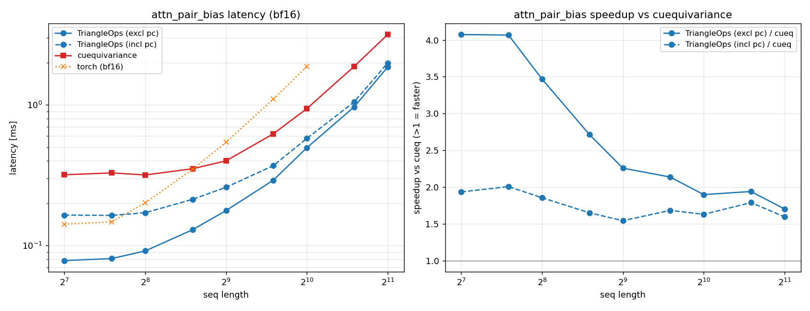
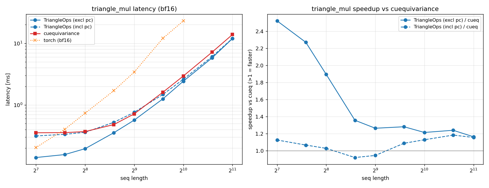
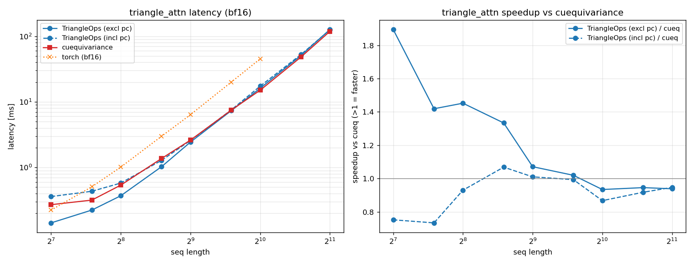

# TriangleOps

Fused Triton kernels for the three AlphaFold-3 **Pairformer** primitives, tuned to
beat NVIDIA `cuequivariance` on H100 (bf16) while being a drop-in replacement:

| op | fused scope | speedup vs cuequivariance (H100, bf16, excl pc) |
|----|-------------|--------------------------------------------------|
| `attention_pair_bias` | QKV proj + LN(Z) + bias proj + attention | **1.7–4.1×** across all M (128–2048) |
| `triangle_multiplicative_update` | LN + gated proj + triangular einsum + gated proj | **1.2–2.5×** across all L (128–2048) |
| `triangle_attention` | LN + Q/K/V proj + bias proj + attention | **1.5–1.9×** for N ≤ 256, ~par to N ≈ 768, cuDNN wins N ≥ 1024 |

All three are **more accurate** than cuequiv (LN affine folded in fp32) and produce
results **bit-identical** to the original `bench/` experiments they were distilled from.

## Benchmarks (H100 PCIe, bf16)

Each plot: **left** = latency vs sequence length (log-log), **right** = speedup vs
cuequivariance (>1 = TriangleOps faster). `excl pc` = precompute amortized at model
init (deployment number); `incl pc` = precompute re-run every call (strict apples-to-
apples). Reproduce with `python -m benchmarks.sweep --op <op> --out-dir assets`
(writes `assets/<op>.png`).

### `attention_pair_bias`  (M = single-seq length; H=4, D=32, C_z=128)


| M | cueq (ms) | TriangleOps excl | **speedup** | incl pc |
|---|-----------|------------------|-------------|---------|
| 128  | 0.319 | 0.078 | **4.07×** | 1.93× |
| 512  | 0.400 | 0.177 | **2.26×** | 1.54× |
| 1024 | 0.941 | 0.496 | **1.90×** | 1.63× |
| 2048 | 3.165 | 1.859 | **1.70×** | 1.60× |

→ faster than cuequiv at **every** size (1.7–4.1× excl, 1.5–2.0× incl).

### `triangle_multiplicative_update`  (L = pair-seq length; D=128, outgoing)


| L | cueq (ms) | TriangleOps excl | **speedup** | incl pc |
|---|-----------|------------------|-------------|---------|
| 128  | 0.354 | 0.141 | **2.52×** | 1.12× |
| 512  | 0.717 | 0.568 | **1.26×** | 0.94× |
| 1024 | 2.946 | 2.428 | **1.21×** | 1.13× |
| 2048 | 13.84 | 11.91 | **1.16×** | 1.15× |

→ faster at every size (excl); incl pc ≈ par (precompute is ~0.17 ms fixed).

### `triangle_attention`  (N = pair-seq length; H=4, D=32, C_in=128)


| N | cueq (ms) | TriangleOps excl | **speedup** | incl pc |
|---|-----------|------------------|-------------|---------|
| 128  | 0.271 | 0.143 | **1.89×** | 0.75× |
| 256  | 0.538 | 0.370 | **1.45×** | 0.93× |
| 768  | 7.49  | 7.35  | 1.02×     | 0.99× |
| 1024 | 15.07 | 16.13 | 0.93×     | 0.87× |

→ wins for **N ≤ 768**; beyond N ≈ 1024 cuequiv's cuDNN-FlashAttention backend
takes over (we materialize the bias separately, it fuses into the attention).

## Layout

```
triangle_ops/                 # the library (no cuequivariance dependency)
├── _common/                  #   shared: LN-affine absorption, weight layouts, dtype
├── attn_pair_bias/           #   kernel.py (@triton.jit + launch) · module.py (public API)
├── triangle_attn/
└── triangle_mul/
tests/                        # correctness vs pure-torch fp32 reference (pytest)
benchmarks/                   # references.py (cueq+torch) · harness.py · sweep.py
assets/<op>.png               # committed benchmark figures (shown above)
results/                      # ad-hoc generated CSV/PNG (gitignored)
```

Three layers: **kernel.py** (raw Triton) → **module.py** (dtype/precompute/public API) →
**tests + benchmarks** (consumers). The library never imports cuequivariance — that lives
only in `benchmarks/references.py`.

## Install / use

```bash
pip install -e .            # or add TriangleOps/ to PYTHONPATH
```

Each op exposes three entry points:

```python
import triangle_ops

# 1) one-shot (precompute INCLUDED) — simplest
out = triangle_ops.triangle_multiplicative_update(
    x, direction="outgoing", mask=mask,
    norm_in_weight=..., norm_in_bias=..., p_in_weight=..., g_in_weight=...,
    norm_out_weight=..., norm_out_bias=..., p_out_weight=..., g_out_weight=...)

# 2) amortized (precompute EXCLUDED) — fold weights once at model init, fast path per call
pre = triangle_ops.triangle_mul.precompute(norm_in_weight, ..., g_out_weight)
out = triangle_ops.triangle_mul.forward(x, pre, direction="outgoing", mask=mask)
```

`triangle_ops.attention_pair_bias` / `triangle_ops.triangle_attention` follow the same
`precompute` / `forward` / one-shot pattern (signatures mirror cuequivariance + K-Fold).

## Design lever: LayerNorm-affine absorption

A LayerNorm followed by a linear projection is collapsed by folding the LN affine into
the projection weight (`_common/ln_absorption.py`):

```
(LN(x) @ Wᵀ)[o] = rstd·(Σ_i x[i]·Wc[o,i] − mean·ΣW[o]) + Bc[o]
    Wc = w_ln·W,  ΣW = Σ Wc,  Bc = Σ b_ln·W      # precomputed once at model init
```

so the fused kernel produces (mean, var, projection) in one Welford pass — no separate
LN kernel/buffer. Per-op kernel specifics are in each `kernel.py` docstring; the headline
optimizations were: D-major einsum layout (triangle_mul/attn), bias materialized once
(triangle_attn 2-launch), K/V concat + larger BLOCK_M (triangle_attn), and load-x-once
internal-k-loop (triangle_mul Kernel A).

## Tests & benchmarks

```bash
# correctness (no cuequiv needed) — 44 cases across dtype × size × direction × mask
CUDA_VISIBLE_DEVICES=1 python -m pytest tests/ -q

# latency sweep vs cuequiv + torch  (needs the `bench` extra: cuequivariance, matplotlib)
CUDA_VISIBLE_DEVICES=1 python -m benchmarks.sweep --op triangle_mul --direction outgoing
CUDA_VISIBLE_DEVICES=1 python -m benchmarks.sweep --op triangle_attn
CUDA_VISIBLE_DEVICES=1 python -m benchmarks.sweep --op attn_pair_bias
```

`triangle_ops` in the sweep = precompute EXCLUDED (deployment number);
`triangle_ops_incl` = precompute INCLUDED (strict apples-to-apples vs cuequiv).

> cuequiv falls back to plain torch below a sequence-length threshold (eager mode):
> `triangle_mul` L≤100 and `attention_pair_bias` M≤100 (pair size M²≤10000). All
> benchmark points at/above 128 compare against its **optimized** kernels.

The research history (v1/v2/v3 variants, profiling, rejected fusions) lives in the
repo's `bench/` tree; TriangleOps ships only the winning kernel per op.
